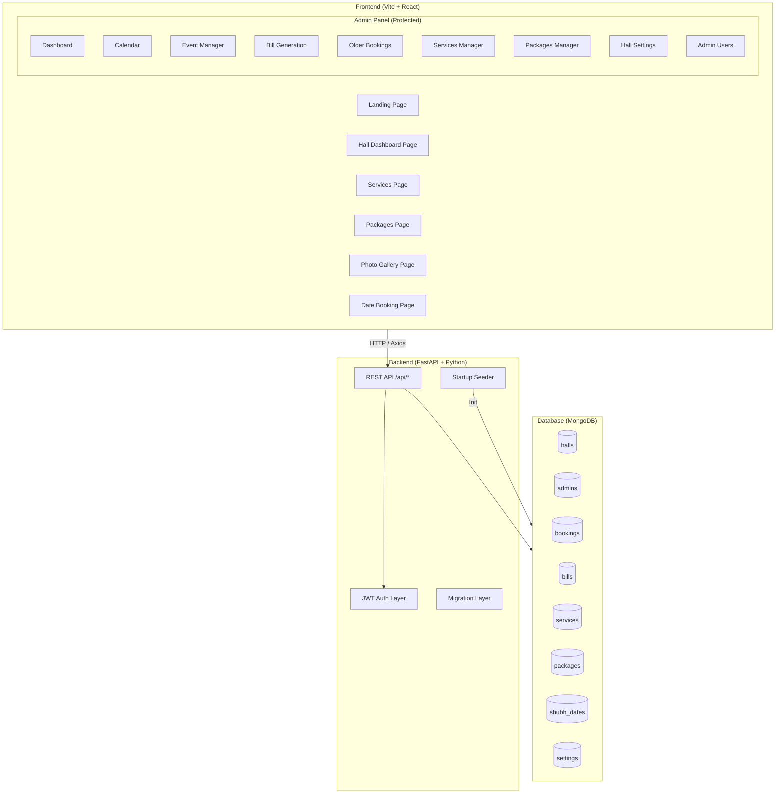
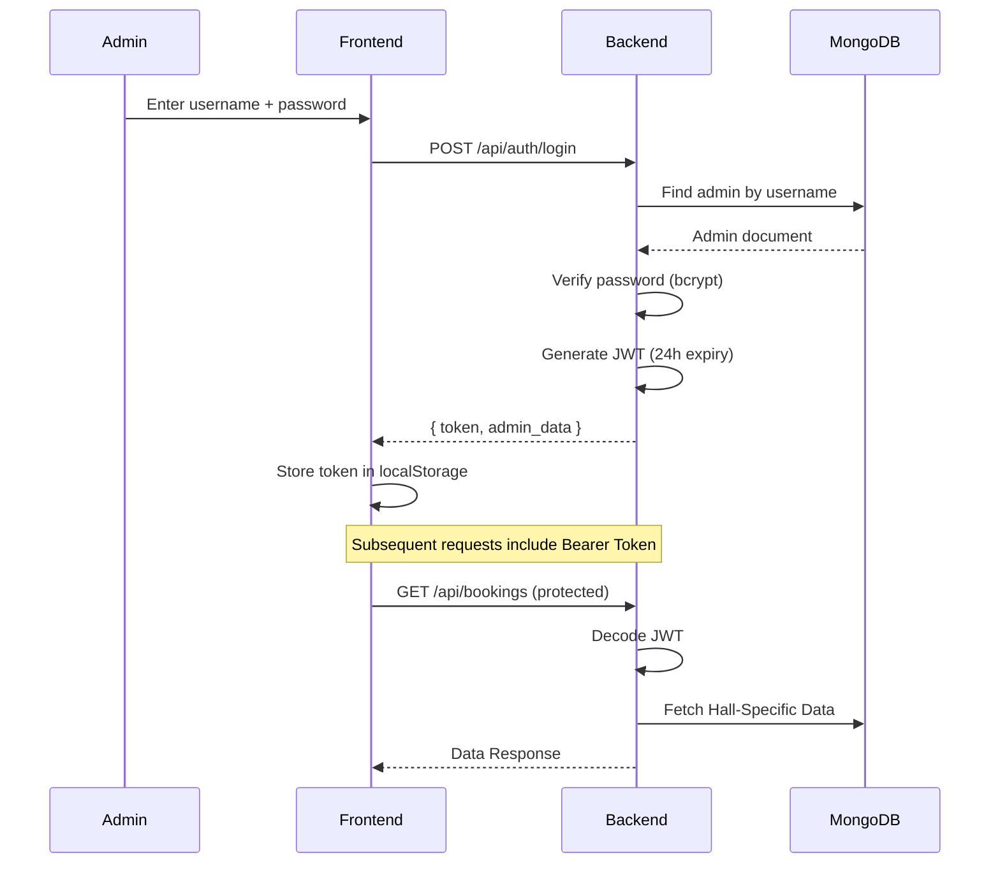

Website Architecture

```mermaid
graph TB
    subgraph Frontend["Frontend (Vite + React)"]
        LP[Landing Page]
        HDP[Hall Dashboard Page]
        SP[Services Page]
        PP[Packages Page]
        PGP[Photo Gallery Page]
        DBP[Date Booking Page]
        
        subgraph AdminPanel["Admin Panel (Protected)"]
            AD[Dashboard]
            AC[Calendar]
            EM[Event Manager]
            BG[Bill Generation]
            OB[Older Bookings]
            AS[Services Manager]
            AP[Packages Manager]
            HS[Hall Settings]
            AU[Admin Users]
        end
    end

    subgraph Backend["Backend (FastAPI + Python)"]
        API[REST API /api/*]
        AUTH[JWT Auth Layer]
        SEED[Startup Seeder]
        MIG[Migration Layer]
    end

    subgraph Database["Database (MongoDB)"]
        halls[(halls)]
        admins[(admins)]
        bookings[(bookings)]
        bills[(bills)]
        services[(services)]
        packages[(packages)]
        shubh_dates[(shubh_dates)]
        settings[(settings)]
    end

    Frontend -->|HTTP / Axios| API
    API --> AUTH
    API --> Database
    SEED -->|Init| Database
```

Sequence Diagram

```mermaid
sequenceDiagram
    participant Admin
    participant Frontend
    participant Backend
    participant MongoDB

    Admin->>Frontend: Enter username + password
    Frontend->>Backend: POST /api/auth/login
    Backend->>MongoDB: Find admin by username
    MongoDB-->>Backend: Admin document
    Backend->>Backend: Verify password (bcrypt)
    Backend->>Backend: Generate JWT (24h expiry)
    Backend-->>Frontend: { token, admin_data }
    Frontend->>Frontend: Store token in localStorage
    
    Note over Frontend,Backend: Subsequent requests include Bearer Token
    Frontend->>Backend: GET /api/bookings (protected)
    Backend->>Backend: Decode JWT
    Backend->>MongoDB: Fetch Hall-Specific Data
    Backend-->>Frontend: Data Response
```
